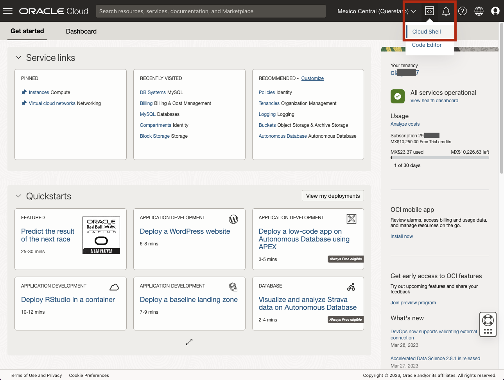
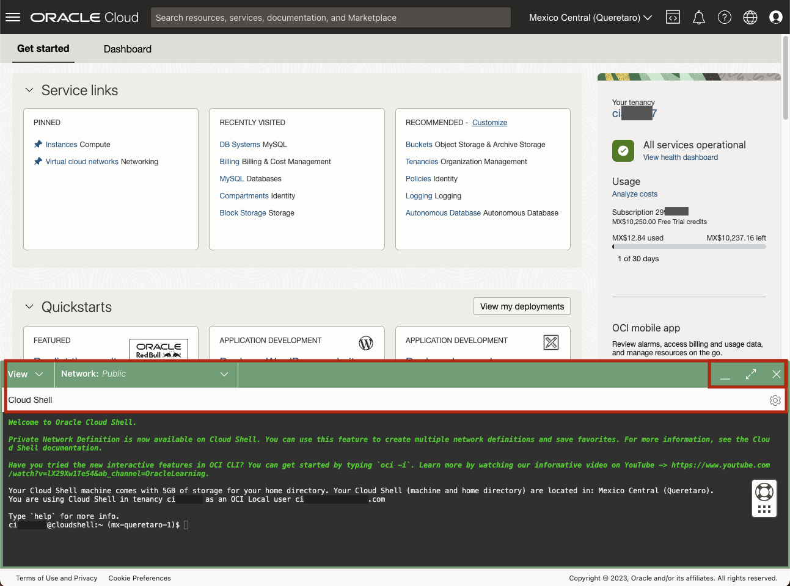
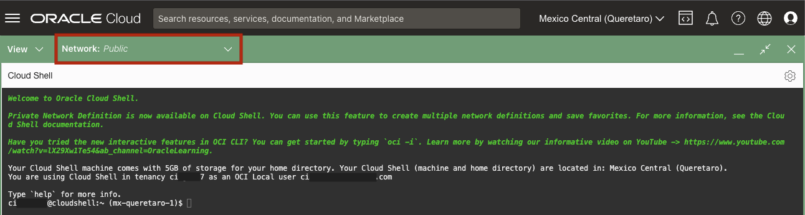
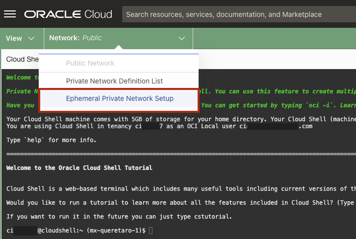
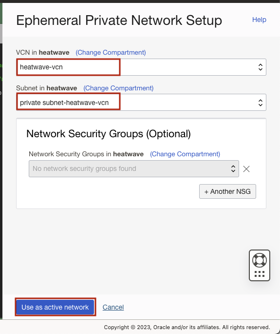
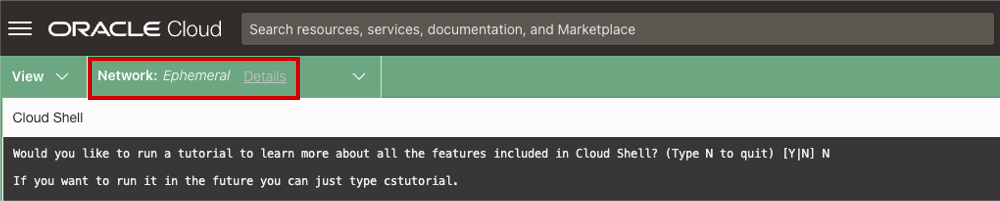
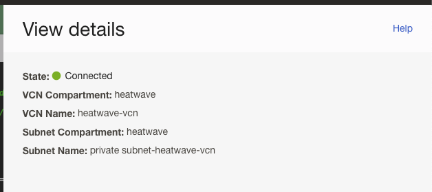
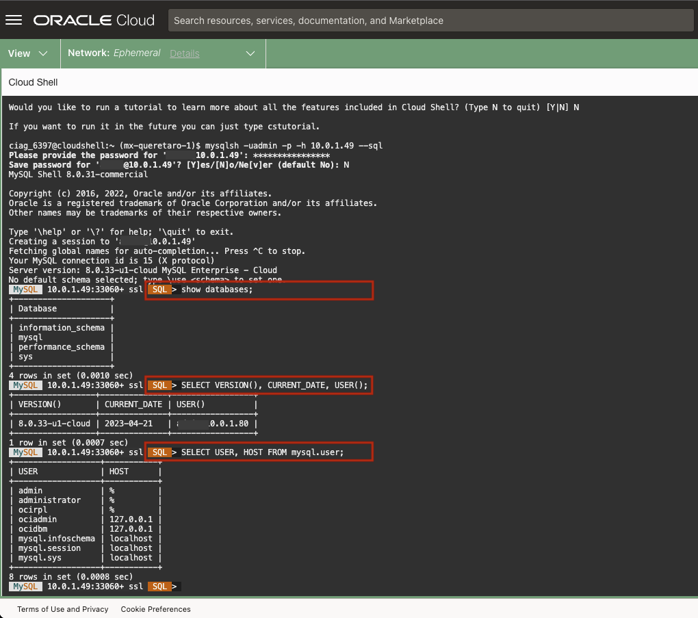
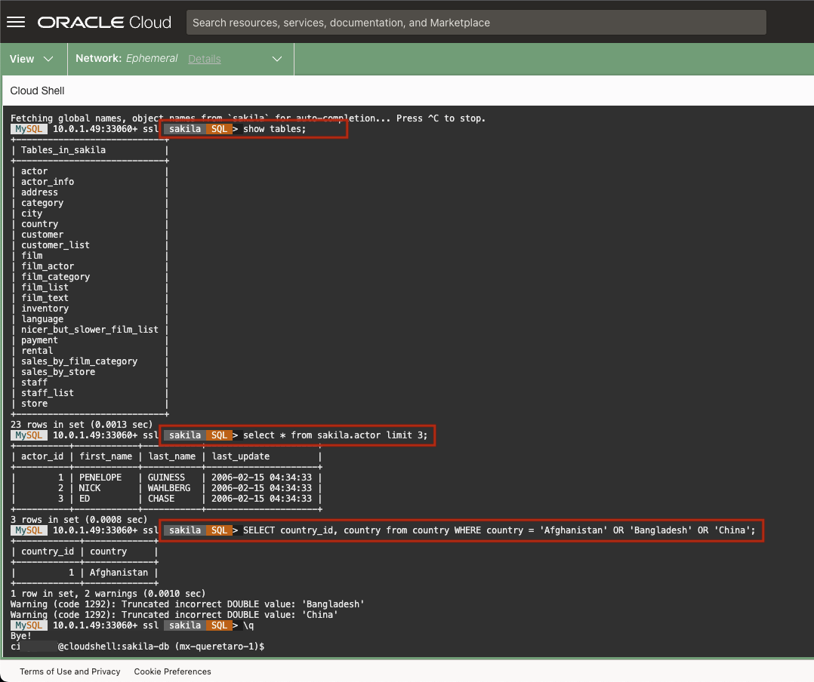
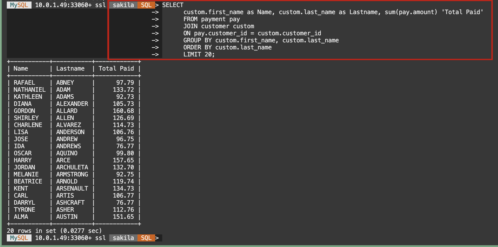

# Connect to MySQL HeatWave With Cloud Shell Private Access and OCI Shell

## Introduction

When working in the cloud, there are often times when your servers and services are not exposed to the public internet. The Oracle Cloud Infrastructure (OCI) MySQL cloud service is an example of a service that is only accessible through private networks. Since the service is fully managed, we keep it siloed away from the internet to help protect your data from potential attacks and vulnerabilities. It’s a good practice to limit resource exposure as much as possible, but at some point, you’ll likely want to connect to those resources. That’s where Cloud Shell Private Access enters the picture. Cloud Shell Private Access allows you to connect a Cloud Shell session to a private network so you can access  your MySQL HeatWave Database without having the network traffic flow over public networks

_Estimated Lab Time:_ 20 minutes

### Objectives

In this lab, you will be guided through the following tasks:

- Connect to Cloud Shell
- Setup Cloud Shell Private Access
- Use MySQL Shell to Connect to your Heatwave Database
- Create and Load Sakila Schema

### Prerequisites

- An Oracle Trial or Paid Cloud Account
- Some Experience with MySQL Shell
- Must Complete Lab 1

## Task 1: Access Cloud Shell via the Console 

1. Login to the Console.
2. Click the Cloud Shell icon in the Console header. Note that the OCI CLI running in the Cloud Shell will execute commands against the region selected in the Console's Region selection menu when the Cloud Shell was started.

    

    This displays the Cloud Shell in a "drawer" at the bottom of the console:

    

    You can use the icons in the upper right corner of the Cloud Shell window to minimize, maximize, restart, and close your Cloud Shell session.

## Task 2: Setup Cloud Shell Private Access

1. To change the network your Cloud Shell session is using to the HeatWave Database network, use the drop-down Network menu at the top of the Cloud Shell terminal window:

    

2. Select the Ephemeral Private Network Setup menu item. this will bring up the  Ephemeral Private Network Setup panel. This panel allows you to select details for the private network you want to use:

    

3. Select the compartment that you want to use, and then select the VCN and the Subnet to use from the drop-down list boxes. You can also optionally select one or more Network Security groups to use.

    

4. Click on **Use as active network** to switch your Cloud Shell network connection to the HeatWave Database network.

    Your Cloud Shell session is now connected to your HeatWave private network, as indicated in the Networking drop-down at the top of the Cloud Shell terminal session:

    

    You can see details about your private network connection by clicking the **Details** link.

    

## Task 3: Use MySQL Shell

1. Connect, using the IP Adress and credentials of the HeatWave Database

    ```bash
    <copy>mysqlsh -uadmin -p -h 10.0.1.... --sql</copy>
    ```

2. View  Database information

   a. To display a list of databases, Enter the following command at the prompt:

      ```bash
      <copy>SHOW DATABASES;</copy>
      ```

   b. Display the database version, current_date, and user enter the following command at the prompt:

      ```bash
      <copy>SELECT VERSION(), CURRENT_DATE, USER();</copy>
      ```

   c. Display MySQL user and host from user table enter the following command at the prompt:

      ```bash
      <copy>SELECT USER, HOST FROM mysql.user;</copy>
      ```

    d. Exit MySQL Shell

      ```bash
      <copy>\q</copy>
      ```
      

## Task 4: Download, Unpack & Import the Sakila sample dataset

1. Download Sakila sample dataset

      ```bash
      <copy> wget https://downloads.mysql.com/docs/sakila-db.zip </copy>
      ```

2. Unzip  Sakila Sample Dataset

      ```bash
      <copy>unzip sakila-db.zip</copy>
      ```

3. Change to Sakila folder

      ```bash
      <copy>cd sakila-db</copy>
      ```

4. Import Sakila schema 

      ```bash
      <copy>mysqlsh -h10.0.1... -uadmin -p --mysql --file sakila-schema.sql</copy>
      ```

5. Import  Sakila data.

      ```bash
      <copy> mysqlsh -h10.0.1... -uadmin -p --mysql --file sakila-data.sql</copy>
      ```

6. Connect to HeatWave Database

      ```bash
      <copy>mysqlsh -uadmin -p -h 10.0.1.... --sql</copy>
      ```

   a. List all of the databases

      ````bash
      <copy>show databases;</copy>
      ````

7. Work with Sakila Database

   a. Point to Sakila schema

      ````bash
      <copy> use sakila;</copy>
       ```` 

   b. List Sakila tables

      ````bash
      <copy>show tables;</copy>
      ```` 

   c. Display Sakila  actors

      ````bash
      <copy>SELECT * FROM sakila.actor LIMIT 3;</copy>
      ```` 

   d. Display Sakila countries

      ````bash
      <copy>SELECT country_id, country FROM country WHERE country = 'Afghanistan' OR 'Bangladesh' OR 'China';</copy>
      ````

      

   e. List the total paid by each customer

      ````bash
      <copy>
      SELECT 
      custom.first_name as Name, custom.last_name as Lastname, sum(pay.amount) 'Total Paid' 
      FROM payment pay
      JOIN customer custom
      ON pay.customer_id = custom.customer_id
      GROUP BY custom.first_name, custom.last_name
      ORDER BY custom.last_name
      LIMIT 20;</copy>
      ````

      

8. Exit MySQL Shell

      ```bash
      <copy>\q</copy>
      ```

You may now **proceed to the next lab**

## Acknowledgements

- **Author** - Perside Foster, MySQL Solution Engineering
- **Contributors** - Airton Lastori, Principal Product Manager, Nick Mader, MySQL Global Channel Enablement , Ravish Patel, MySQL Solution Engineering , Karthik Gnanakumar, MySQL Solution Engineering 
- **Last Updated By/Date** - Perside Foster, MySQL Solution Engineering, Oct 2022