# Create your Compartment and Virtual Cloud Network

## Introduction

Create a compartment and Virtual Cloud Network (VCN) to connect your Linux instance to the internet. You will configure all the components needed to create your virtual network.

_Estimated Time:_ 15 minutes

### Objectives

In this lab, you will be guided through the following tasks:

- Create Compartment
- Create Virtual Cloud Network
- Configure security list to allow MySQL incoming connections

### Prerequisites

- An Oracle Free Tier or Paid Cloud Account
- A web browser
- Login to OCI to land on OCI Dashboard (This image shows a trial account)

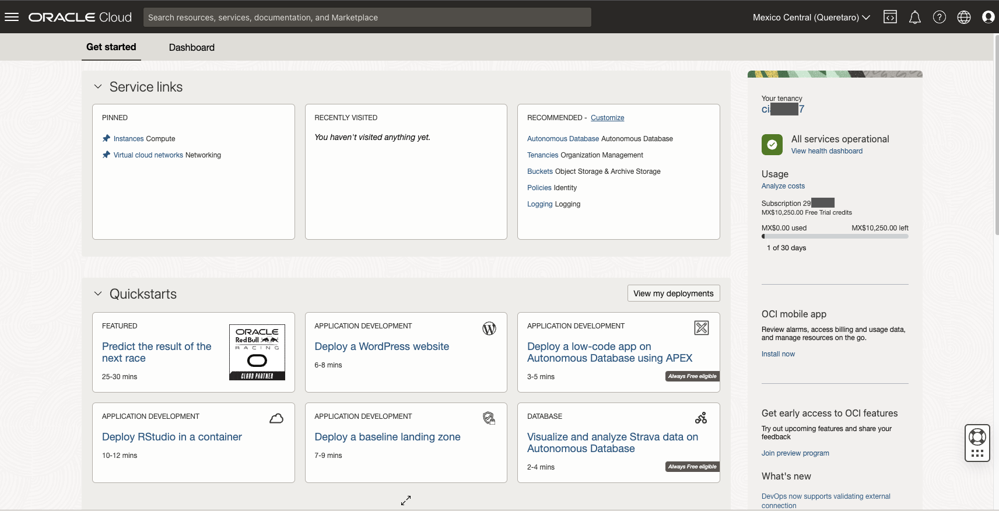

## Task 1: Create Compartment

1. Click the **Navigation Menu** in the upper left, navigate to **Identity & Security** and select **Compartments**.

    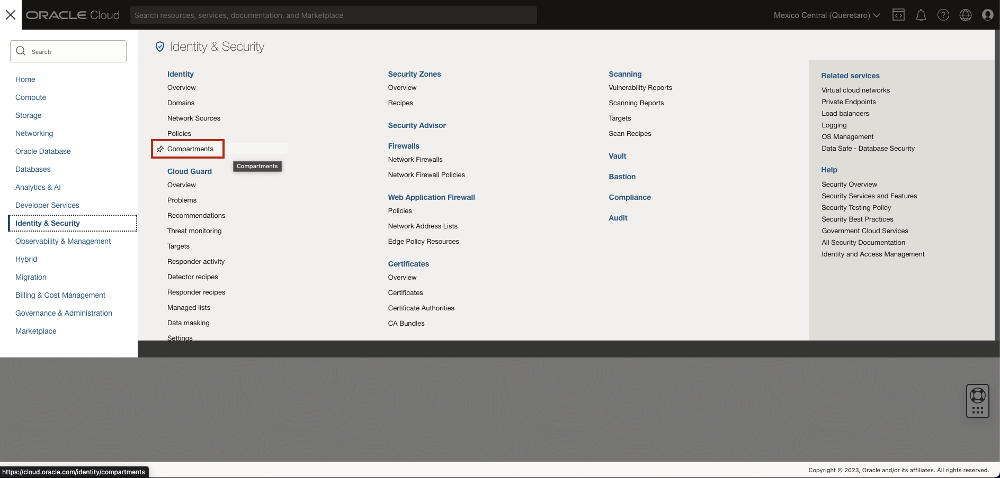

2. On the Compartments page, click **Create Compartment**.

    **Note:** Two Compartments, _Oracle Account Name_ (root) and a compartment for PaaS, were automatically created by the Oracle Cloud.

3. In the Create Compartment dialog box,  do the following:

    a. In the **NAME** field, enter **heatwave**

    b. Enter a Description enter **Compartment for MySQL HeatWave Database and components**

    c. Select the **Parent Compartment**

    d. Click **Create Compartment**.

    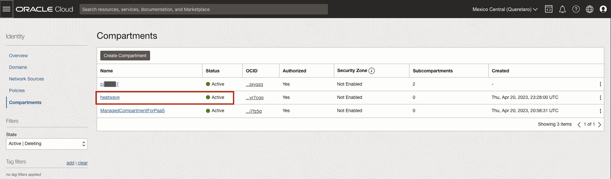

## Task 2: Create Virtual Cloud Network

1. Click Navigation Menu
    , Select Networking
    , Select Virtual Cloud Networks
    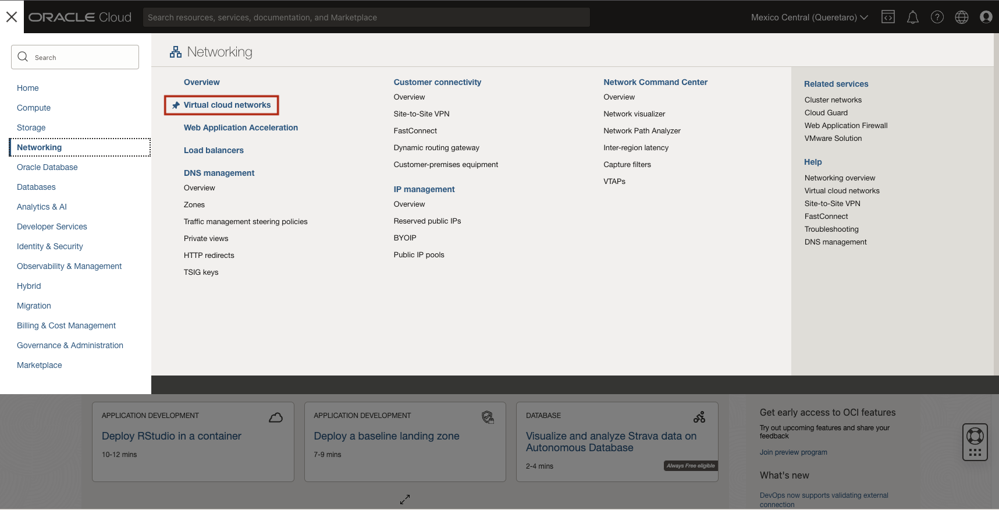

2. Click **Start VCN Wizard**
    

3. Select 'Create VCN with Internet Connectivity'

    Click 'Start VCN Wizard'
    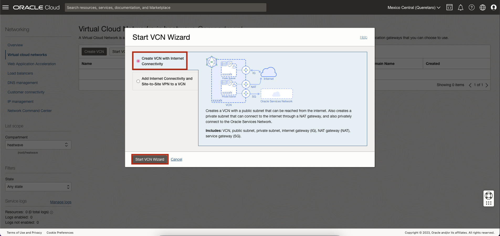

4. Create a VCN with Internet Connectivity

    On Basic Information, complete the following fields:

    VCN Name:

    ```bash
    <copy>heatwave-vcn</copy>
    ```

    Compartment: Select  **heatwave**

    Your screen should look similar to the following:
        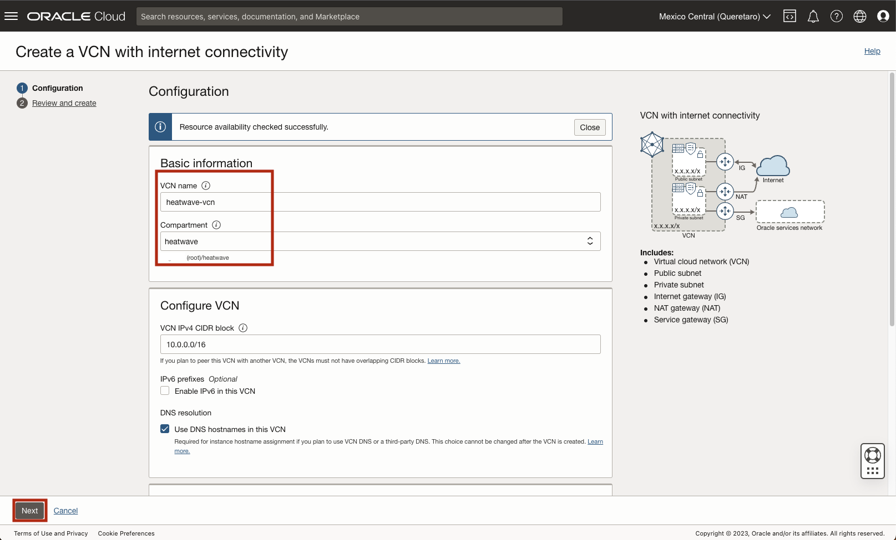

5. Click 'Next' at the bottom of the screen

6. Review Oracle Virtual Cloud Network (VCN), Subnets, and Gateways

    Click 'Create' to create the VCN
    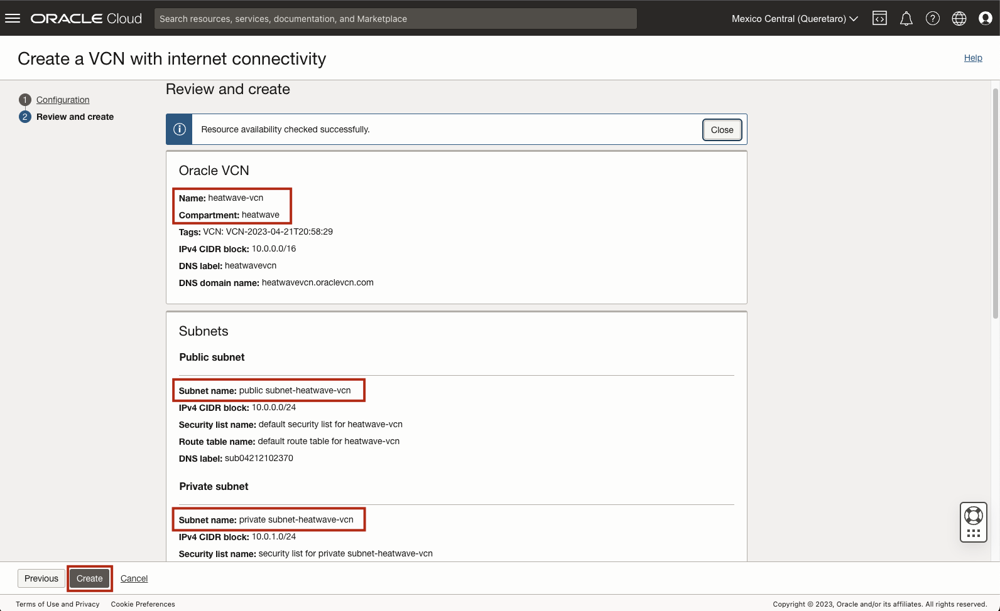

7. The Virtual Cloud Network creation is completing
    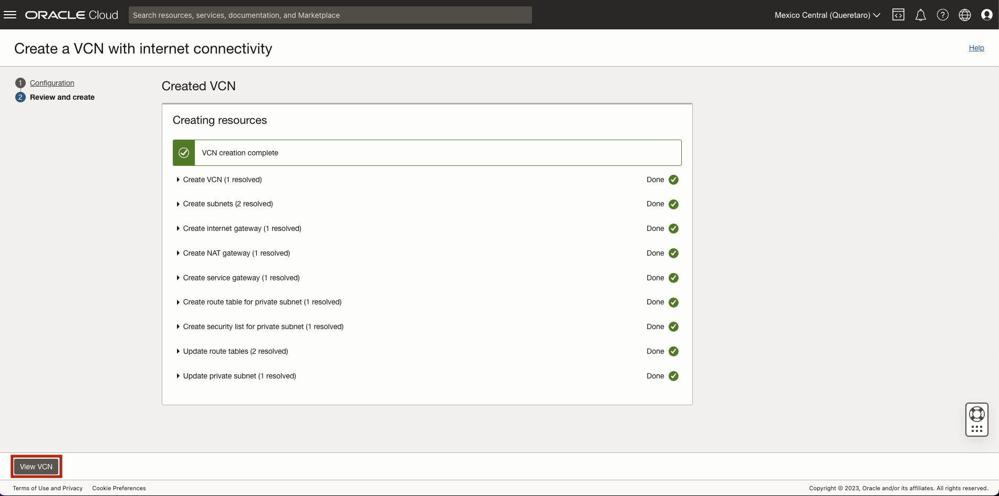

8. Click 'View Virtual Cloud Network' to display the created VCN
    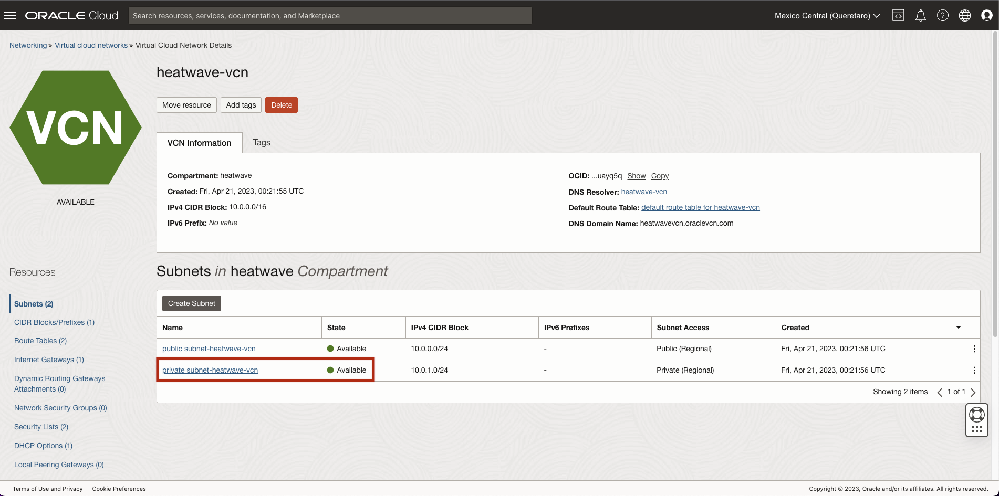

## Task 3: Configure security list to allow MySQL incoming connections

1. On heatwave-vcn page under 'Subnets in heatwave Compartment', click  '**Private Subnet-heatwave-vcn**'
     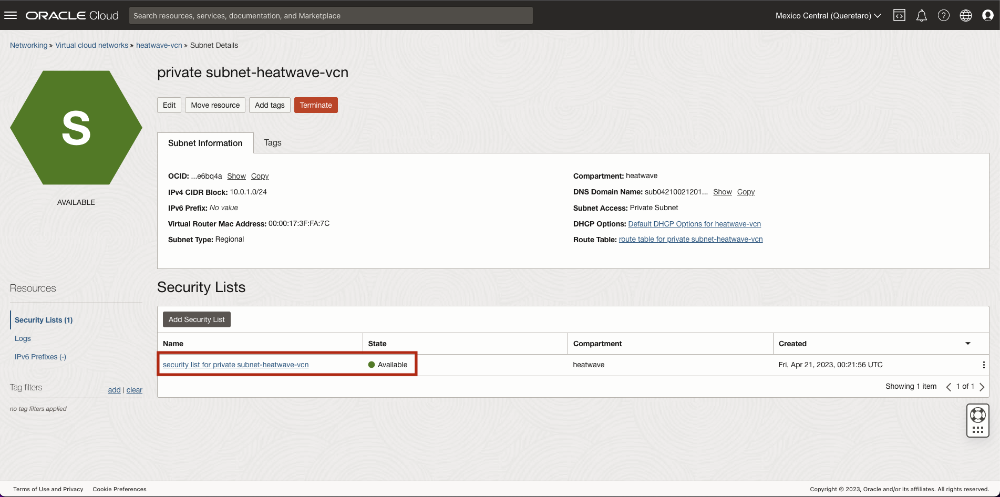

2. On Private Subnet-heatwave-vcn page under 'Security Lists',  click  '**Security List for Private Subnet-heatwave-vcn**'
    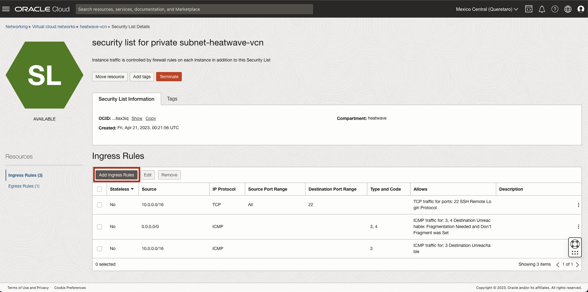

3. On Security List for Private Subnet-heatwave-vcn page under 'Ingress Rules', click '**Add Ingress Rules**'
    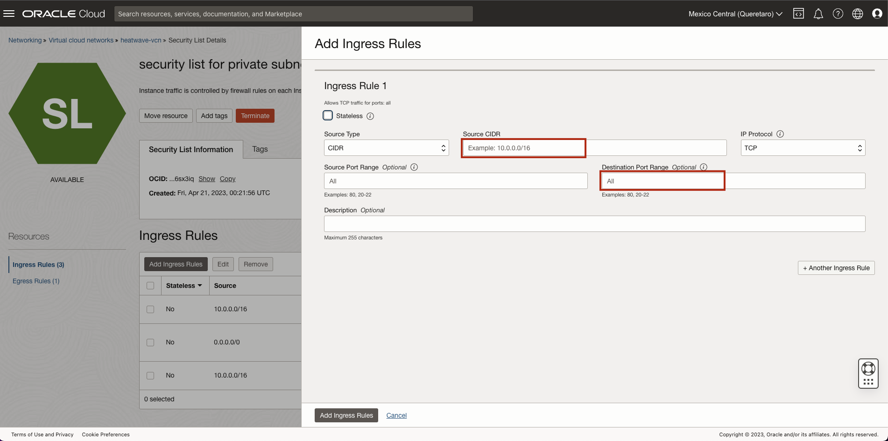

4. On Add Ingress Rules page under Ingress Rule 1

    Add an Ingress Rule with Source CIDR
        ```
        <copy>0.0.0.0/0</copy>
        ```

    Destination Port Range
        ```
        <copy>3306,33060</copy>
        ```
    Description
        ```
        <copy>MySQL Port Access</copy>
        ```
    Click 'Add Ingress Rule'
        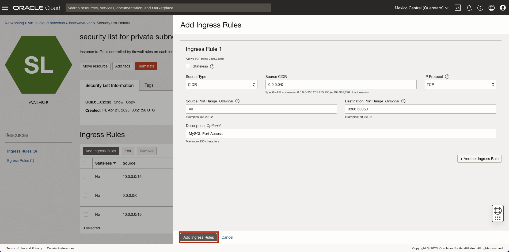

5. On Security List for Private Subnet-heatwave-vcn page, the new Ingress Rules will be shown under the Ingress Rules List
    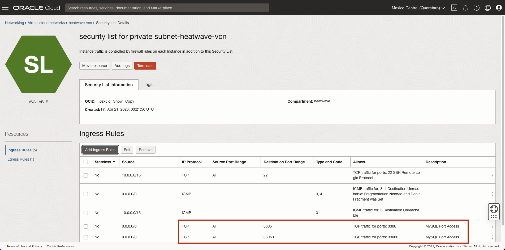

You may now **proceed to the next lab**

## Acknowledgements

- **Author** - Perside Foster, MySQL Solution Engineering
- **Contributors** - Airton Lastori, Principal Product Manager, Nick Mader, MySQL Global Channel Enablement , Ravish Patel, MySQL Solution Engineering , Karthik Gnanakumar, MySQL Solution Engineering 
- **Last Updated By/Date** - Perside Foster, MySQL Solution Engineering, Oct 2022