# Create MySQL HeatWave Standard Database

## Introduction

In this lab, you will create and configure a MySQL Standalone DB System.

_Estimated Time:_ 10 minutes

### Objectives

In this lab, you will be guided through the following tasks:

- Create a Standalone MySQL Database instance

### Prerequisites

- An Oracle Trial or Paid Cloud Account
- Some Experience with MySQL Shell
- Must complete Lab 1

## Task 1: Create a MySQL DB System - Standalone or High Availability or Heatwave 

In this Task, you will create and configure a MySQL Standalone DB System.

1. Open the navigation menu. Under Databases -> MySQL, click DB Systems
    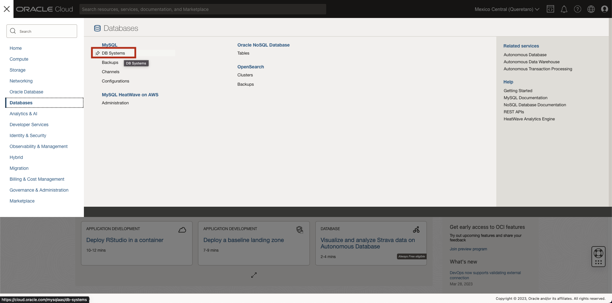

2. Click 'Create DB System'
    

3. Create MySQL DB System dialog complete the fields in each section

    - Provide basic information for the DB System
    - Setup your required DB System
    - Create Administrator credentials
    - Configure Networking
    - Configure placement
    - Configure hardware
    - Exclude Backups

4. Provide basic information for the DB System:

    Select Compartment **heatwave**

    Enter Name
        ````
        <copy>heatwave-sa</copy>
        ````
    Enter Description
        ````
        <copy>MySQL HeatWave Database Service Standalone instance</copy>
        ````
5. Setup your DB system

    Select the **Development or Testing** Option

    Explore the different System options:

    Select **Standalone** to specify a single-instance DB system
        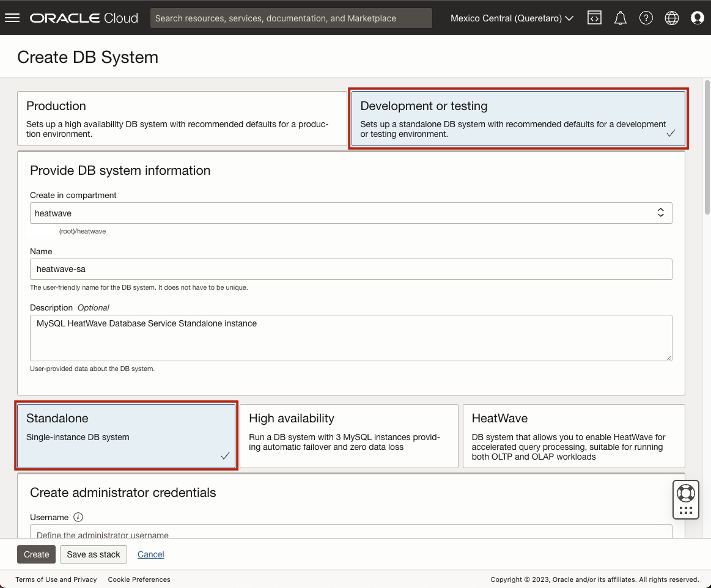

    Select **High Availability** to specify a three-instance DB system that contains one primary instance and two secondary instances.
        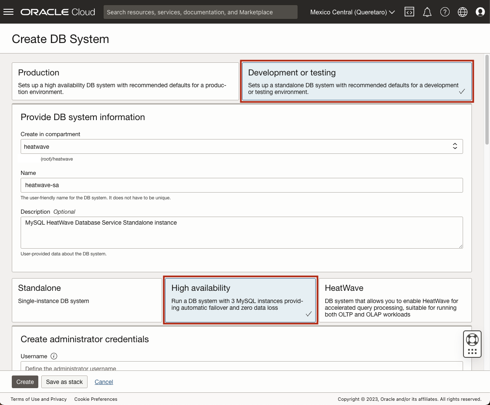

    Select **HeatWave** to specify a Standalone DB system with a HeatWave-compatible shape for attaching a HeatWave Cluster to the DB system
        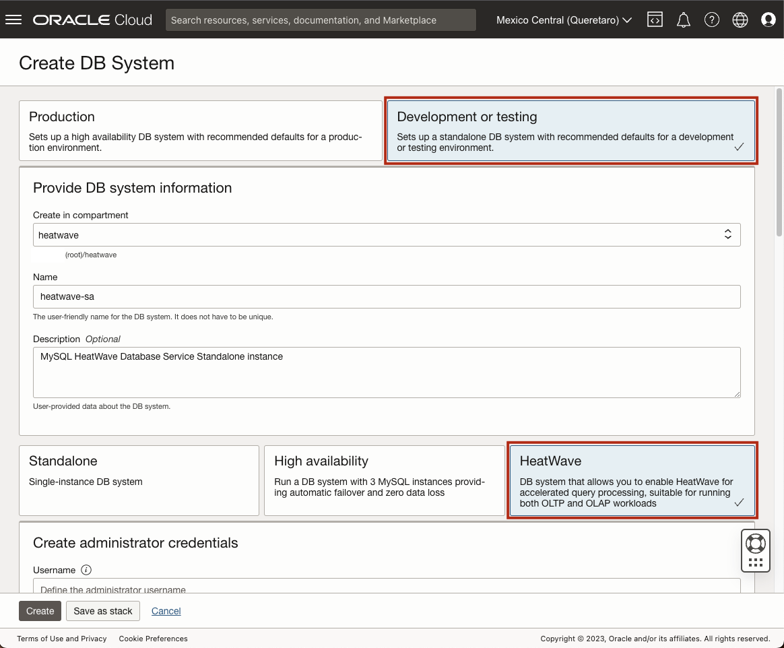

    Choose **Standalone** as the desired option for this Lab

6. Create Administrator credentials

    **Enter Username** (write username to notepad for later use)

    **Enter Password** (write password to notepad for later use)

    **Confirm Password** (value should match password for later use)

    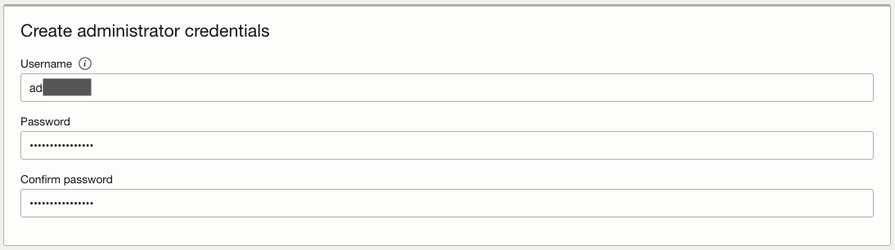

7. Configure networking Keep default values

    Virtual Cloud Network: **heatwave-vcn**

    Subnet: **Private Subnet-heatwave-vcn (Regional)**

    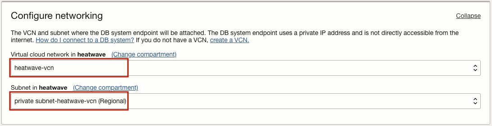

8. Configure placement  keep checked  "Availability Domain"

    Do not check "Choose a Fault Domain" for this DB System. Oracle will choose the best placement for you.
    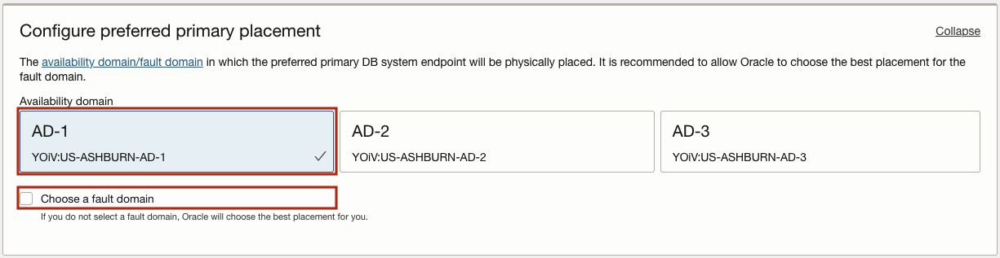

9. Configure hardware keep default shape

10. Configure Backups, "Enable Automatic Backups"

    **Turn off** button to disable automatic backup

    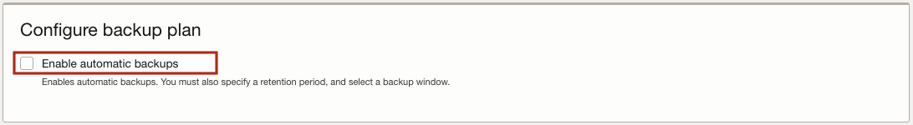

    Click the **Create button**
    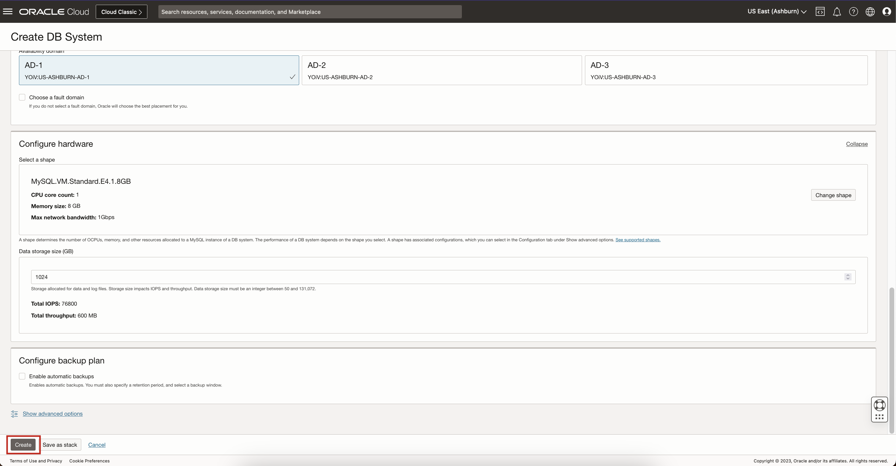

11. The New MySQL HeatWave DB System will be ready to use after a few minutes.

    The state will be shown as Creating during the creation
    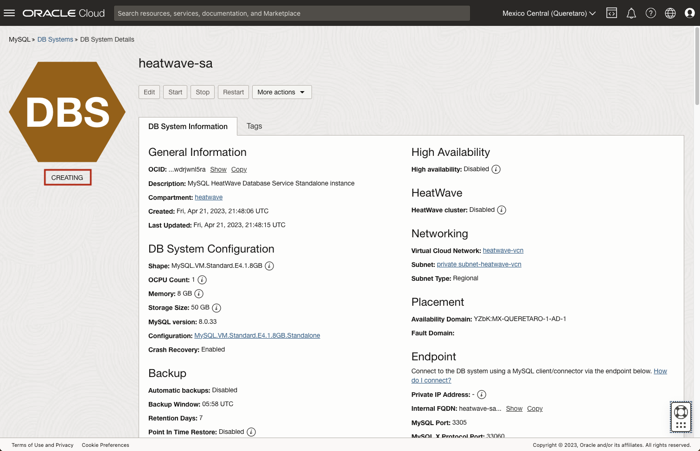

12. The state Active indicates that the DB System is ready to use.

    Check  the MySQL endpoint (Address) under Instances in the MySQL DB System Details page -> Endpoint, Private IP Adress .

    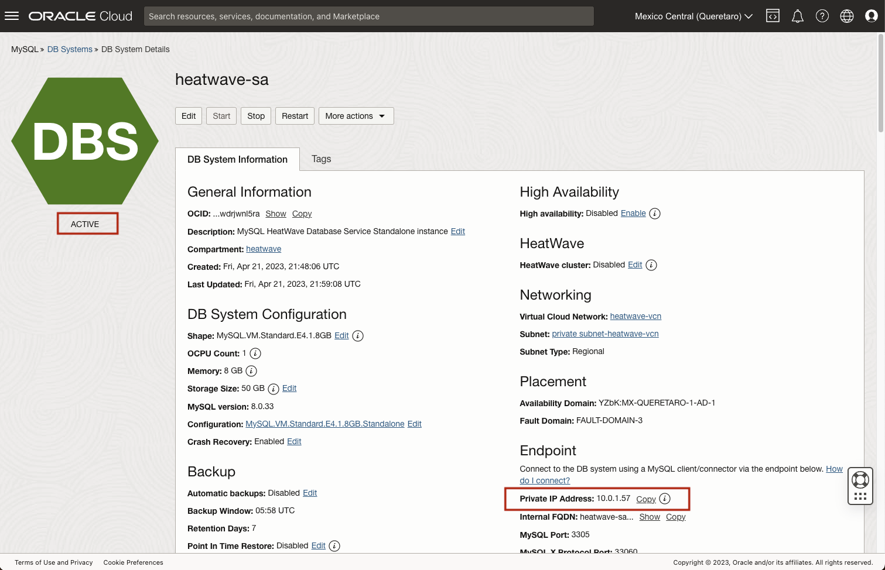

You may now **proceed to the next lab**

## Acknowledgements

- **Author** - Perside Foster, MySQL Solution Engineering
- **Contributors** - Airton Lastori, Principal Product Manager, Nick Mader, MySQL Global Channel Enablement , Ravish Patel, MySQL Solution Engineering , Karthik Gnanakumar, MySQL Solution Engineering 
- **Last Updated By/Date** - Perside Foster, MySQL Solution Engineering, Oct 2022
