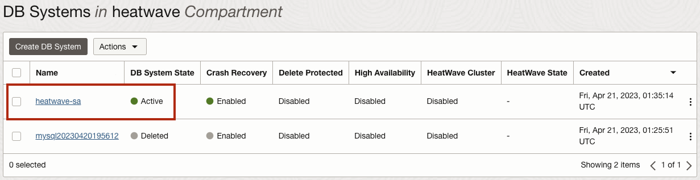
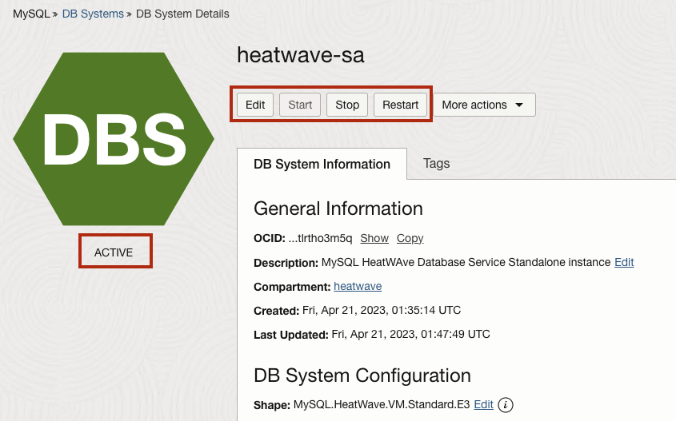
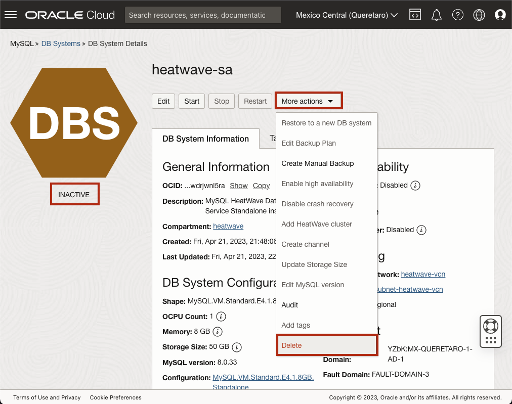
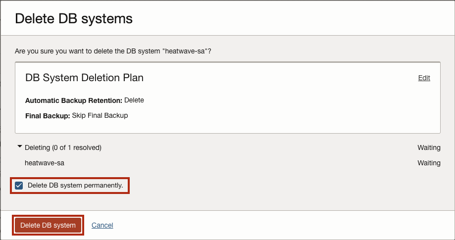

# Manage HeatWave Standard DB System

## Introduction

In  this lab you will use the Console to manage your MySQL HeatWave DB system.

## Task 1: Start, Stop, or Reboot MySQL Database System

1. Click the **Navigation Menu** in the upper-left corner, navigate to **Databases**, and select **DB Systems**.

   

2. List Database Systems.

   

3. Select the **heatwave** Compartment and click **heatwave-sa** to open the MySQL DB System Details page.

    

4. Select one of the following actions:

    - Start: Starts a stopped database system. After the database system is started, the **Stop** action is enabled and the **Start** option is disabled.
    - Stop: Stops a running database system. After the database system is powered off, the **Start** action is enabled.
    - Restart: Shuts down a database system, and restarts it.

     > **Note:**  Stopping a database system stops billing for all OCPUs associated with it.
       - Billing continues for storage.
       - Billing for OCPUs resumes if you restart the database system.
       - If you selected **Stop** or **Restart**, the Stop/Restart MySQL Database System dialog box is displayed.

5. Select a shutdown type:

     - Fast: Flushes dirty pages before shutting down the database system. Some flush operations must        be performed during the next startup, potentially increasing the duration of the start-up    process.
     - Slow: Flushes dirty pages and purges undo log pages for older transactions. The shutdown itself can take longer, but the subsequent startup is faster.
     - Immediate: Does not flush dirty pages and does not purge any undo log pages. Stops MySQL immediately. Page flushes and log purging will take place during the next startup, increasing the duration of the start-up process.

6. Select the required shutdown type and click **Stop** or **Restart**, depending on the action chosen.

## Task 2: Delete the MySQL Database System

Deleting a database system is permanent. Any manual backups associated with the deleted database system are retained for their retention periods. Automatic backups are deleted with the database system.

1. Click the **Navigation Menu** in the upper-left corner, navigate to **Databases**, and select **DB Systems**.

   

2. Choose the **heatwave** Compartment.

3. List Database Systems.

   

4. Click **heatwave-sa** to open the MySQL DB System Details page.

    

5. You can Stop the instance first, or delete while running.
   
   Click the **More Actions** drop-down list, select **Delete**.

    

    > **Note:** A prompt is displayed, asking you to confirm the deletion.

    

6. You will have to check the box with the label "Delete DB system permanently", then click **Delete DB System**.

When the delete process is done, **heatwave-sa** will be set to the **Delete** status.

You may now **proceed to the next lab**

## Learn More

-  [Oracle Cloud Infrastructure MySQL Database Service Documentation ](https://docs.cloud.oracle.com/en-us/iaas/mysql-database)
- [MySQL Database Documentation](https://www.mysql.com)

## Acknowledgements

- **Author** - Perside Foster, MySQL Solution Engineering
- **Contributors** - Airton Lastori, Principal Product Manager, Nick Mader, MySQL Global Channel Enablement , Ravish Patel, MySQL Solution Engineering , Karthik Gnanakumar, MySQL Solution Engineering 
- **Last Updated By/Date** - Perside Foster, MySQL Solution Engineering, Oct 2022