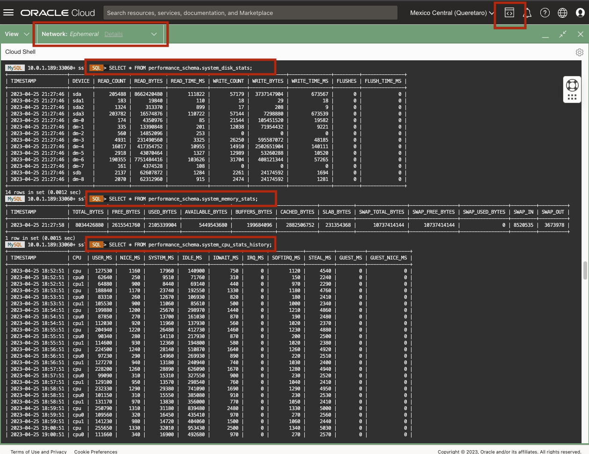
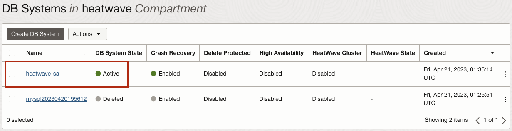
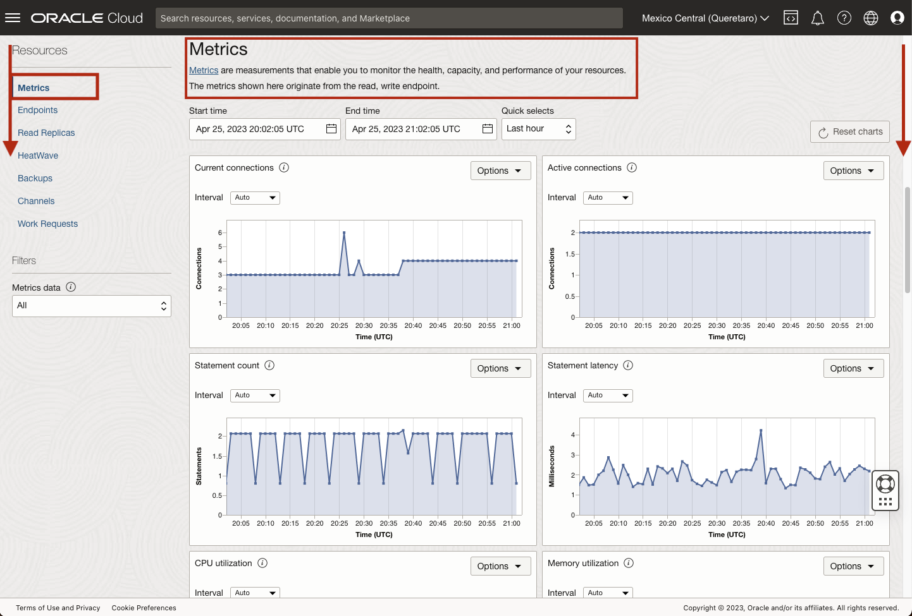
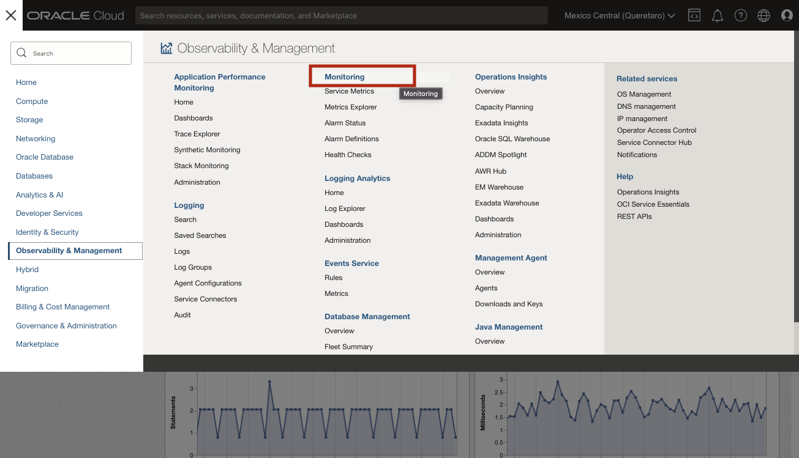
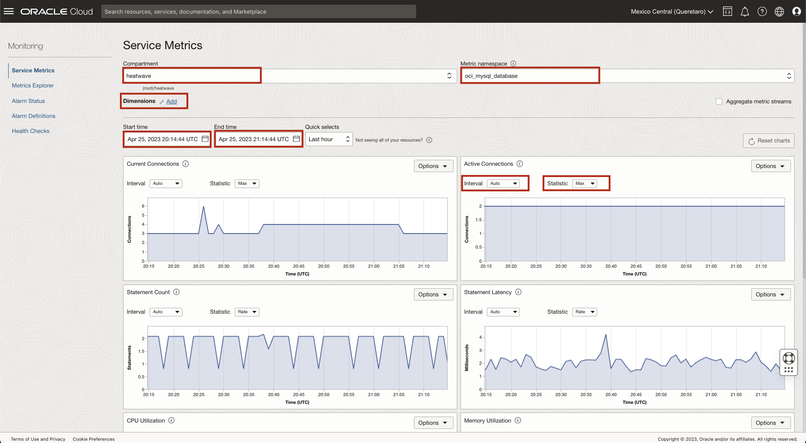
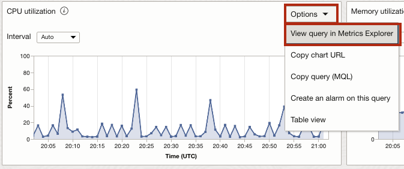
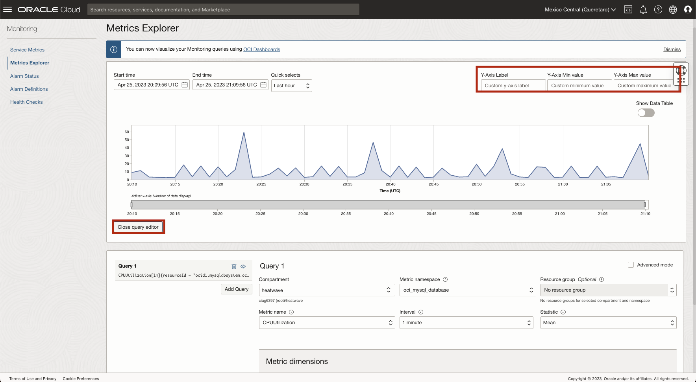
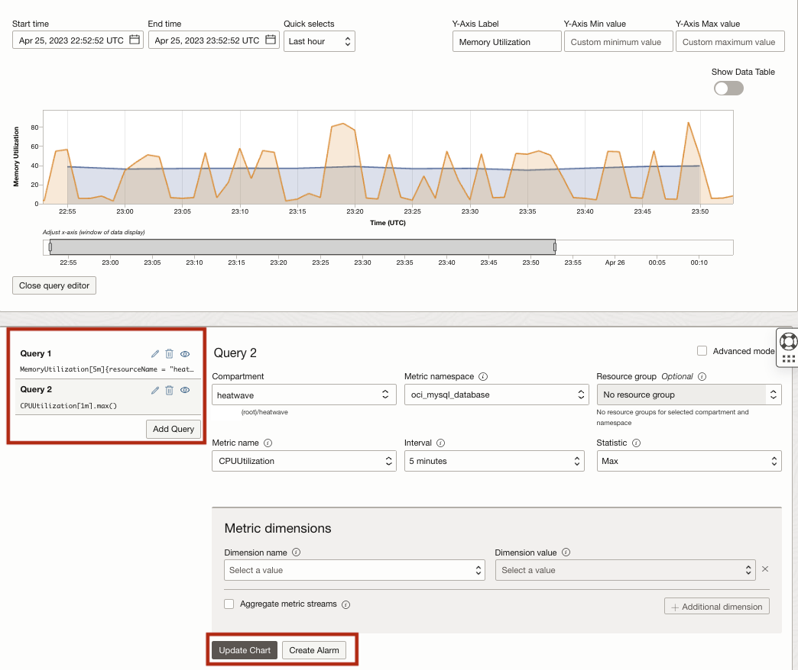

# Monitoring MySQL HeatWave Standard DB System

## Introduction

In  this lab you will use the Console to monitor your MySQL HeatWave DB system.

_Estimated Lab Time:_ 10 minutes

### Objectives

In this lab, you will be guided through the following tasks:

- Use MySQL Shell to access and query information from the Health Monitor Tables
- Explore the Metrics Charts from the DB System Details
- Use the Monitoring Dashboard to see the Service Metrics
- Use the Monitoring Dashboard to see the Metric Explorer

### Prerequisites

- An Oracle Trial or Paid Cloud Account
- Some Experience with MySQL Shell
- Must Complete Lab 3

## Task 1: Access the Performance Schema Tables from MySQL Shell

1. Use the previous Ephemeral Private Connection to connect with the HeatWave Database.

    ```bash
    <copy>mysqlsh -uadmin -p -h 10.0.1.... --sql</copy>
    ```

2. Query information from the Performance Schema Tables

   a. Display information about 'Disk Usage Statistics':

      ```bash
      <copy> SELECT * FROM performance_schema.system_disk_stats;</copy>
      ```

   b. Display information about 'Memory Usage Statistics':

      ```bash
      <copy>SELECT * FROM performance_schema.system_memory_stats</copy>
      ```

   c. Display information about 'CPU Usage Statistics':

      ```bash
      <copy>SELECT * FROM performance_schema.system_cpu_stats_history;</copy>
      ```

   

3. Exit MySQL Shell

      ```bash
      <copy>\q</copy>
      ```

## Task 2: Explore the Metrics in the DB System Details of the Heatwave Standard DB System


1. Click the **Navigation Menu** in the upper-left corner, navigate to **Databases**, and select **DB Systems**.

   

2. List Database Systems.

   

3. Select the **heatwave** Compartment and click **heatwave-sa** to open the MySQL DB System Details page.

   **Scroll Down** until you can see  the Metrics as the following image:

   

   Here, you can see important metrics collected by OCI from your DB System like: Connections; CPU, Disk and Memory utilization; and Network information.

   This same metrics can be accessed from the Monitoring menu. 

## Task 3: Use the Monitoring Dashboard to see the Service Metrics and the Metric Explorer


1. Click the **Navigation Menu** in the upper-left corner, navigate to **Observability & Management** and select **Monitoring**.

    

2. The **Service Metrics** page will open

   Choose the **heatwave** Compartment and **oci mysql database** in 'Metric Namespace'.

   

   The same metric charts from the DB System Details appear, and you can apply the same extra filters and actions: 
      
      - Selecting different intervals and statistics
      - Changing Start Time and End Time
      - Adding Dimensions

3. Position on the 'CPU Utilization' chart and click the **Options** drop-down list, select **View query in Metrics Explorer**

   

   The **Metric Explorer** tool will open with the selected metric. Metric Explorer allows for a more detailed monitoring analysis.

   

   You can click on **Edit queries** to inspect and modify the query

   In addition to the previous filters and actions, in the Metric Explorer page you can:

      - Customize Y-Axis Label
      - Customize X & Y Axes values
      - Add Multiple customized and detailed queries in the same chart
      - Create Alarms
   
   

## Acknowledgements

- **Author** - Cristian Aguilar, MySQL Solution Engineering
- **Contributors** - Perside Foster, MySQL Solution Engineering 
- **Last Updated By/Date** - Cristian Aguilar, MySQL Solution Engineering, May 2023